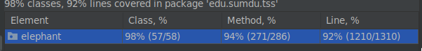
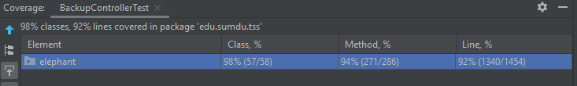

# Elephant project

See full documentation and requirements at https://confluence.elearning.sumdu.edu.ua/x/GQAM

## Note
All tests are on the testing branch

## How to run tests (Instruction)
The first step you need is to write config with valid settings (you can see all the properties below in the readme file).
If you use Windows you need to add the **your_path_to_postgres/bin** folder as path variable, if you don't do it 
tests that works with **pg_dump** and **pg_restore** will fail and won't cover the code. When you run the integration 
tests you may get the error described after this section. To run e2e you need the following browsers: firefox, edge, chrome.
To run all the tests (unit, integrations and e2e with 3 browsers and with different resolutions) you need to run 
**run_test.sh** using bash (e.g. git bash or different terminal or program that can execute bash script), also you need 
**maven** for this. The e2e runs with chrome and fullscreen resolution by default (if any browser is not settled).
I don't know why but Idea shows different count lines of code in Linux and Windows. The report was written based 
on code coverage in Linux.
#### Linux 

#### Windows


## Intellij idea problem with integration tests
If you want to run all tests with coverage you will get an ExceptionInInitializerError in the AccessManager class 
on [this line](https://github.com/ThePersonThat/elephant/blob/11f29efff526e5bdfcb0eb1732ab88638d80896c/src/main/java/edu/sumdu/tss/elephant/middleware/CustomAccessManager.java#L27).
You can fix it by going through all the steps in the answer here:
https://youtrack.jetbrains.com/issue/IDEA-274803

## Prerequisites

Project is written on Java 16 (17 work to). Project requires maven (bundled with Intelj Idea or standalone), PostgreSQL
13+, GIT

## Installation

### First step

Clone this (or you command) GIT repository to your computer :)

### Postgresql

1. Download and install postgresql from official site https://www.postgresql.org/download/
2. Configure PostgreSQL to be able to get connection from any user via network:

For local development add to `pg_hba.conf` :

    # IPv4 local connections:
    host    all             all             127.0.0.1/32            scram-sha-256

For public server add to `pg_hba.conf` :

    # IPv4 local connections:
    host    all             all             0.0.0.0/0            scram-sha-256

and to `postgresql.conf` change

    listen_addresses = 'localhost'

to

    listen_addresses = '*'

3. Check postgresql bin folder in your classpath (e.i. yore able to start pg_dump / pg_restore without specifying its directory)

### Config file

Create config file (any name) with values for keys placed blow. All keys are mandatory. All keys can be specified as OS
environment variables.

| Key   | Value |    
|-------|-------|
|DB.PORT | Postgresql port (By default 5433 or 5432. See `postgresql.conf`)
|DB.LOCAL_PATH| Path to all user-generated file (databases, backups, script) |
|DB.HOST | Postgresql address from local connections (Suitable value 127.0.0.1) |
|DB.URL | Postgresql address for external users ( can be same as site domain name or as DB.HOST) | 
|DB.NAME | Name of database for Elephant app |
|DB.USERNAME | Postgresql user for all project-ralated tasks |
|DB.PASSWORD | Password for DB.USERNAME user | 
|DB.OS_USER| OS User, owner of postgresql process. (By default `postgresql` for Linux, and any value for Windows). For linux all postgresql tablespace MUST be owned by DB.OS_USER user|
|APP.URL| Application url (including domain, protocol and port, mostly used for mails) |
|APP.PORT| Internal port for application. Port can be different from APP.URL port, if there is any proxy (like nginx) before Elephant |  
|EMAIL.HOST|SMTP server for sending mails (For example: smtp.gmail.com)|
|EMAIL.PORT|SMTP port 465|
|EMAIL.USER|SMTP user|
|EMAIL.PASSWORD|SMPT user password |
|EMAIL.FROM|Value for "mail from" field (mostly same as EMAIL.USER )|
|EMAIL.SSL| true/false - use or not ssl on connection to SMTP server|
|DEFAULT_LANG| EN or UK|
|ENV| PRODUCTION or other . In PRODUCTION mode error page does not show stack traces |

Example:

```
DB.PORT=5433
DB.LOCAL_PATH=c:\\tmp\\elephant_temp\\
DB.HOST=127.0.0.1
DB.URL=127.0.0.1
DB.NAME=elephant
DB.USERNAME=postgres
DB.PASSWORD=test
DB.OS_USER=WINDOWS

APP.URL= http://127.0.0.1:7000
APP.PORT=7000

EMAIL.HOST=smtp.gmail.com
EMAIL.PORT=465
EMAIL.FROM=service-mail@gmail.com
EMAIL.PASSWORD=my-secret-password
EMAIL.USER=service-mail@gmail.com

DEFAULT_LANG=EN
ENV=PRODUCTION
```

### Create database

Before start, you must create database %DB.NAME% owned to %DB.USERNAME% and seed it by migrations SQL.

Substitute %KEY% with its real value.

```
psql -p %DB.PORT% -h %DB.HOST% -U %DB.USERNAME% -c "create database %DB.NAME% owner %DB.USERNAME%;"
psql -p %DB.PORT% -h %DB.HOST% -U %DB.USERNAME% -d %DB.NAME% < src/main/resources/migrations/*.sql
```

### Linux

For linux distribution you must allow do `sudo chwon` without password for owner of Elephant process.

## How to run?

1. Build project
   `mvn clean install -DskipTest=true`
2. run
   `java -jar target/elephant.jar %your-config-file%`

# Contributors

Kuzikov Borys <b.kuzikov@dl.sumdu.edu.ua>
